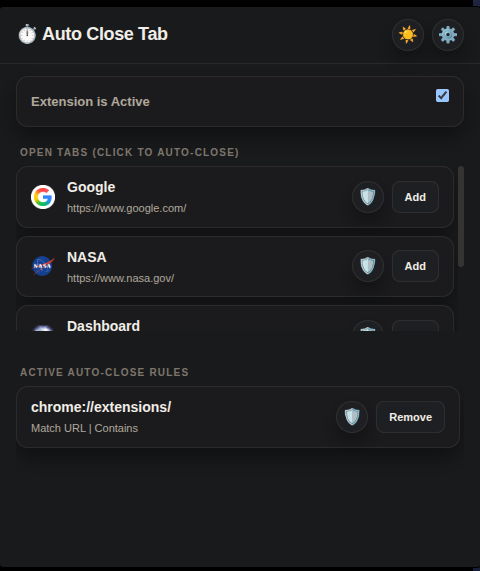

# ⏱️ Auto Close Tab

A modern Chrome extension designed to declutter your browser by automatically closing tabs that match your custom rules. Built with a premium aesthetic and productivity in mind.

### ⏱️ Timer Accuracy & Limitations

Due to Google Chrome's [Alarms API](https://developer.chrome.com/docs/extensions/reference/alarms/) limitations, there are a few things to keep in mind regarding timing:

- **Minimum Reliable Interval**: Chrome enforces a minimum alarm interval of **1 minute**. 
- **Hybrid Precision**: This extension uses a "Hybrid Timing" system. For rules set to **less than 60 seconds**, we use high-precision timeouts while you are actively using the browser.
- **Background Throttling**: If the browser is idle or minimized, Chrome may throttle the extension's background processes, potentially delaying auto-close actions for rules under 1 minute until the next "pulse" (usually every 60 seconds).
- **Efficiency**: This approach ensures maximum battery life and minimum CPU usage while still providing the best possible accuracy for your rules.

---

## ✨ Features

- **Quick Add**: Open the popup and add any current tab to your auto-close list with one click.
- **Rule-based Deletion**: Define rules based on **URL** or **Page Title** snippets.
- **Multiple Match Types**:
  - **Contains**: Match if the snippet exists anywhere in the URL/Title.
  - **Exact**: Match only the precise URL or Title.
  - **Regex**: Use powerful Regular Expressions for complex matching. (Note: These are **case-sensitive** by default).

### 💡 Matching Examples

| Match Type | Value | Target (URL or Title) | Result |
| :--- | :--- | :--- | :--- |
| **Contains** | `youtube` | `https://www.youtube.com/watch?v=...` | ✅ Match |
| **Contains** | `Inbox` | `Inbox (1) - Gmail` | ✅ Match |
| **Exact** | `https://news.google.com/` | `https://news.google.com/` | ✅ Match |
| **Exact** | `google.com` | `https://www.google.com/` | ❌ No Match (URL must be exact) |
| **Regex** | `reddit\.com/r/.*` | `https://www.reddit.com/r/programming/` | ✅ Match |
| **Regex** | `^Google` | `Google Search` | ✅ Match (Starts with Google) |
| **Regex** | `(facebook\|instagram)\.com` | `https://www.facebook.com/home` | ✅ Match (Multiple domains) |
| **Regex** | `\.pdf$` | `https://example.com/report.pdf` | ✅ Match (Ends with .pdf) |
| **Regex** | `q=(temp\|weather)` | `https://google.com/search?q=weather` | ✅ Match (Query params) |

> [!TIP]
> Since matching is **case-sensitive**, if you want to match both "Google" and "google", you can use a character class like `[Gg]oogle`.
- **Flexible Timer**:
  - Set a default closure duration.
  - Choose between **Seconds** or **Minutes** for precise control.
- **Focus Protection (Per Rule)**:
  - Toggle **"Protect tab while in focus"** for each rule.
  - If enabled, the extension will never close a tab you are currently viewing, even if it matches a rule.
- **Quick Management**:
  - Toggle protection on/off instantly using the 🛡️ icon in the popup.
  - Edit existing rules directly from the options page.
- **Premium Design**:
  - Dark and Light mode support.
  - Clean, responsive interface following modern design standards.
- **Privacy First**: No data collection. All rules and settings are stored locally.

## 🛠️ Installation

1. Clone or download this repository.
2. Open Chrome and navigate to `chrome://extensions/`.
3. Enable **Developer mode** (top right toggle).
4. Click **Load unpacked** and select the extension folder.

## 🚀 How to Use

### Using the Popup
1. Click the extension icon in your toolbar.
2. The **Open Tabs** list shows all tabs in your current window.
3. Click the 🛡️ icon to decide if the tab should be protected while you are looking at it.
4. Click **Add** to create a rule for that tab's URL.
5. The **Active Rules** section shows everything currently being monitored.

### Advanced Configuration
1. Click the ⚙️ icon in the popup to open the **Options Page**.
2. **General Settings**: Set your preferred auto-close duration (e.g., 5 minutes or 30 seconds).
3. **Manage Rules**: View all your rules. Click ✏️ to edit or 🗑️ to delete.
4. **Add New Rule**: Manually create rules with specific match types (URL/Title/Regex).

## 🔒 Privacy

Your data belongs to you. This extension does not track your browsing history or send any data to external servers. All matching logic and storage happen entirely on your local machine.

See the full [Privacy Policy](docs/privacy-policy.md) for more details.

## 📄 License

MIT License - feel free to use and modify for your own productivity needs!